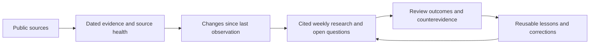

# Every Fantasy Football Knowledge

A public, shared research library for fantasy-football players and their LLMs. Same evidence for everyone, no private league data, and no assumed level of football knowledge.

[](https://github.com/boo13/every-fantasy-football-knowledge/actions/workflows/check.yml)
[](https://github.com/boo13/every-fantasy-football-knowledge/actions/workflows/weekly.yml)

## Start here

| Need | Read |
| --- | --- |
| Give an LLM useful context | [START_HERE.md](START_HERE.md) |
| Understand football and fantasy | [Beginner guide](docs/football-and-fantasy.md) |
| Know what is happening now | [Current collected evidence](context/CURRENT.md) and [latest research](research/LATEST.md) |
| Make draft, waiver, trade, or lineup decisions | [Decision framework](docs/decision-framework.md) and [copyable prompts](prompts/README.md) |
| Understand a term | [Football glossary](docs/glossary.md) |
| Check source quality and gaps | [Source registry](SOURCES.md) |
| Understand how this compounds | [Weekly runbook](docs/weekly-runbook.md), [learning index](docs/solutions/README.md), [open questions](research/questions.json) |

**No rankings here are promises.** Historical results are labeled by season, player status can lag, and null does not mean healthy. Check timestamps and official availability before setting a lineup. League settings must come from the person asking the LLM, in their own private conversation.

## What updates automatically

1. **GitHub Actions, Tuesdays at 13:17 UTC** (9:17 a.m. US Eastern during daylight time, 8:17 a.m. otherwise): fetch public sources, validate, append an observation, compare with the previous observation, rebuild current context, and commit the results. No paid API or LLM key is required by this collector.
2. **Compounding research, Tuesdays at 11 a.m. America/New_York:** a separately configured Codex follow-up reads the fresh collection, researches material changes, writes a source-cited briefing, reviews prior questions, and updates durable lessons with Compound Engineering. This requires the owner's Codex environment and authenticated GitHub access; it is not part of GitHub Actions and is not installed by cloning this repo. The [runbook](docs/weekly-runbook.md) makes the same process runnable by anyone with a capable LLM.

The collector works without Codex. Synthesis uses the configured LLM's normal usage allowance. If synthesis misses a week, collected evidence still updates; check the research date separately. GitHub schedules can be delayed and public-repository schedules may be disabled after inactivity: [GitHub schedule documentation](https://docs.github.com/en/actions/how-tos/manage-workflow-runs/disable-and-enable-workflows).

**News coverage:** ESPN's RSS feed returns an empty response from the GitHub runner, although it worked in the local bootstrap. Hosted collection explicitly marks news `manual_research`; the separate research follow-up gathers and verifies public news. A green data run does not mean that week's news has been researched. Local collection can include RSS; use `--skip-news` if that source is unavailable in your environment.

## How knowledge compounds



Evidence snapshots are append-only. Briefings separate facts from inference. Questions stay open until evidence answers them. Durable lessons include applicability and limitations; superseded conclusions stay discoverable through dated corrections and Git history. A pile of repeated headlines is not a learning.

## Run locally

Python 3.12+; standard library only. `just` is optional.

```sh
git clone https://github.com/boo13/every-fantasy-football-knowledge.git
cd every-fantasy-football-knowledge
python3 -m unittest discover -s tests -v
python3 scripts/collect.py
python3 scripts/validate.py --fresh --healthy
```

Equivalent recipes: `just test`, `just collect`, `just validate`, `just check`. The collector writes files, but never runs Git or publishes by itself. Do not fetch the full player catalog more than once per day; reuse the latest snapshot for research.

To refresh remotely: Actions → **Weekly public football context** → **Run workflow**, or `gh workflow run weekly.yml`. To pause collection: disable that workflow. To pause synthesis: disable its separate Codex automation. Forks must explicitly enable scheduled Actions; the Codex automation does not follow a fork.

## Privacy and contribution rules

Only public professional-football information belongs here. **Never commit employee information, company information, private messages, personal profiles, credentials, league identifiers, manager names, team ownership, private rosters, or individual transaction plans.** See [PRIVACY.md](PRIVACY.md). The repository name is not a claim of company sponsorship.

Contributions are welcome through reviewed pull requests. Cite original sources, keep uncertainty explicit, run the checks, and inspect the diff before publishing. Do not paste proprietary rankings, paywalled articles, or entire news stories. [NOTICE.md](NOTICE.md) distinguishes original material from third-party data.
